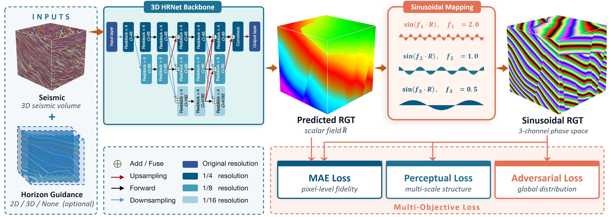
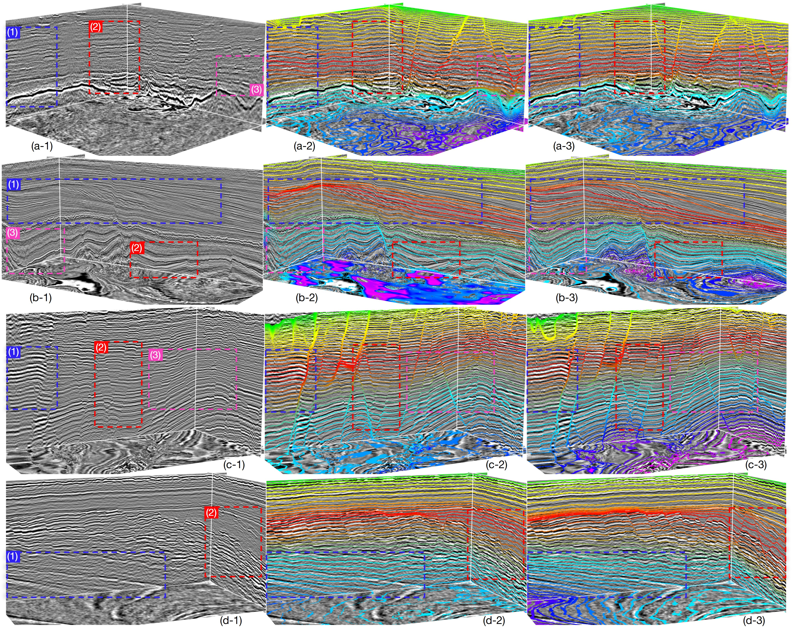
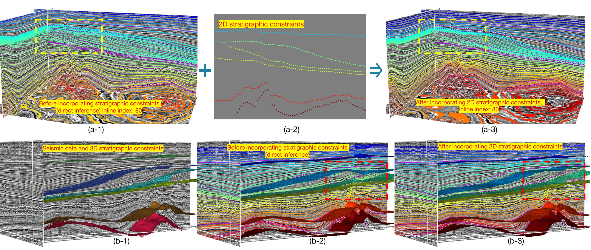
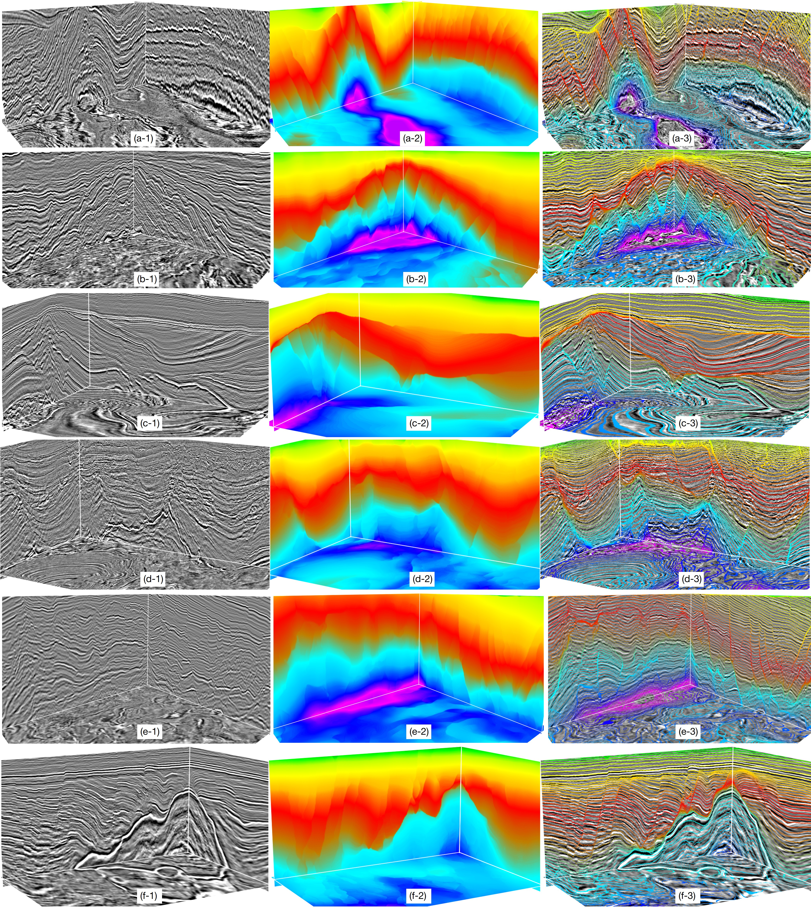

# RGT-Est

**Learning Stratigraphically Consistent Relative Geologic Time from 3D Seismic Data via Sinusoidal Mapping**

Yimin Dou, Xinming Wu*, Hui Gao, Zhengfa Bi

Released as the RGT-estimation entry of **CIGbench**.

---

## Abstract

Relative Geologic Time (RGT) estimation from seismic data underpins subsurface structural modeling, depositional analysis, and reservoir characterization. Accurate RGT estimation remains challenging because RGT is a topologically constrained continuous field — local errors readily propagate globally through topological coupling and distort the overall result. Conventional methods rely heavily on prior information and manual interaction, while existing deep-learning approaches predominantly use MSE/MAE regression, which struggles to recover thin horizons and to capture the stratigraphic semantics of the RGT field.

We propose **RGT-Est**, a deep-learning framework that transfers the optimization target from the topologically constrained continuous field into a differentiable sinusoidal space. This representation explicitly encodes the periodic stratigraphic semantics of RGT and alleviates the over-smoothing of fine horizons inherent in direct regression. Pointwise, perceptual, and adversarial losses are jointly imposed in this space to enforce local fidelity, inter-layer consistency, and global structural plausibility. An optional horizon-guidance module accepts sparse 2D or 3D horizons as priors.

Trained on synthetic data and evaluated on field surveys with dense faulting, large unconformities, steeply dipping strata, folded deformations, and clinoforms, RGT-Est achieves state-of-the-art performance among AI-based methods, and attains substantially higher horizon-correlation accuracy and topological consistency when sparse priors are incorporated.




---

## Contributions

1. **A sinusoidal-space modeling paradigm for RGT estimation.** We reformulate RGT estimation from continuous scalar-field regression into a multi-scale phase optimization problem. Three sinusoidal channels with linearly decreasing frequencies explicitly encode the periodic stratigraphic semantics of RGT and yield a unique representation of any RGT value, fundamentally alleviating the over-smoothing of thin layers caused by MSE/MAE losses.

2. **A multi-loss collaborative mechanism for global topological constraints.** We jointly impose adversarial, perceptual, and MAE losses in the sinusoidal space, constraining the network from three complementary perspectives — distributional consistency, structural fidelity, and pointwise accuracy — and equipping it with both fine-horizon discrimination and robust global stratigraphic awareness.

3. **Optional sparse horizon guidance.** An optional Horizon Guidance module accepts sparse 2D or 3D horizons as priors. RGT-Est operates fully automatically without any prior; once horizons are provided, it delivers substantially higher precision and naturally preserves lateral consistency in slice-by-slice 3D prediction.

4. **Systematic multi-scenario generalization evaluation.** We evaluate RGT-Est on multiple structurally complex field seismic datasets covering unconformities, densely faulted systems, steeply dipping structures, and strong structural superposition, substantially outperforming publicly available AI-based RGT estimation methods.



Qualitative comparison of RGT estimation on field seismic volumes. From left to right, each group presents the input seismic volume, the result of DeepRGT$^\dagger$ (re-implementation), and the result of the proposed RGT-Est. For both methods, the displayed horizons are extracted as iso-surfaces from the estimated RGT fields and overlaid on the seismic volumes for visual comparison. The colored dashed boxes highlight challenging regions, including weak reflectors, slope structures, faulted zones, and laterally varying stratigraphy. RGT-Est better follows seismic reflectors and preserves more coherent stratigraphic ordering.

---



Effect of stratigraphic constraints on RGT estimation. The purple lines represent the input 2D horizon constraints, which also serve as reference lines for the horizons. (a) Incorporating 2D horizon constraints into RGT-Est. The purple dashed curves denote ground-truth horizons used for visual comparison, and the yellow boxes highlight regions where the constrained result better honors the target stratigraphic geometry. (b) Incorporating sparse 3D horizon constraints into RGT-Est. The input seismic volume and 3D horizon constraints are shown on the left, while the direct inference result and the constraint-guided result are shown in the middle and on the right, respectively. Both 2D and 3D constraints significantly improve horizon alignment and spatial consistency of the estimated RGT field.


---




Representative RGT estimation results on challenging field surveys. From left to right, each row shows the input seismic volume, the estimated RGT field, and the horizons extracted from the estimated RGT field and overlaid on the seismic volume. The six rows correspond to the Costa Rica survey, the Poseidon survey in Australia, two Netherlands surveys, and two field surveys from a region in China. These examples cover complex geological settings, including strong deformation, steeply dipping reflectors, faulted structures, multi-stage stratigraphic units, and diapiric or intrusive structures. RGT-Est produces coherent RGT fields and contours that generally follow the seismic reflectors across these challenging surveys

---

## Data & Pretrained Models

The data and pretrained model weights are released through the following mirrors:

- **Zenodo** (recommended for international users): <https://zenodo.org/doi/10.5281/zenodo.20118902>
- **Baidu Netdisk** (recommended for users in China): <https://pan.baidu.com/s/1Sgk4lNUpYpWK6h2t6nnlTQ> — access code: `s3u4`

Both mirrors contain identical contents, including the pretrained checkpoint `RGT-Est_CIG-Benchmark.pt` referenced in the inference snippet below.

---

Quick inference:

```python
import torch, torch.nn as nn, torch.nn.functional as F

model = torch.jit.load("RGT-Est_CIG-Benchmark.pt").to(device).eval()

# 3-channel input [seismic, horizon, mask]; zero channels 1, 2 for automatic mode.
x = F.interpolate(torch.cat([seis, horiz, mask], dim=1), (400, 512, 512), mode="nearest")
with torch.no_grad(), torch.autocast(device_type=device):
    rgt = model(nn.ReflectionPad3d(8)(x))[:, :, 8:-8, 8:-8, 8:-8]
```

See `demo/RGT-Est_demo.ipynb` and `demo/RGT-Est_horizConstra_demo.ipynb` for end-to-end examples. 

---

## Citation

```bibtex
@article{dou2026learning,
  title={Learning Stratigraphically Consistent Relative Geologic Time from 3D Seismic Data via Sinusoidal Mapping},
  author={Dou, Yimin and Wu, Xinming and Gao, Hui and Bi, Zhengfa},
  journal={arXiv preprint arXiv:2605.01273},
  year={2026}
}
```

Correspondence: Xinming Wu — `xinmwu@ustc.edu.cn`.
## License

This repository is released under a dual-license scheme:

- **Source code** (everything under `framework/`, `seisDataset/`, `demo/`,
  and the training/inference scripts) is licensed under the
  [MIT License](https://opensource.org/licenses/MIT).
- **Data and pretrained model weights** distributed via Zenodo and
  Baidu Netdisk are licensed under the
  [Creative Commons Attribution 4.0 International License (CC BY 4.0)](https://creativecommons.org/licenses/by/4.0/).

You are free to use, modify, and redistribute the code, data, and weights —
including for commercial purposes — provided that appropriate credit is given
to the authors and the original publication is cited (see the Citation section above).
The software and data are provided "as is", without warranty of any kind.

